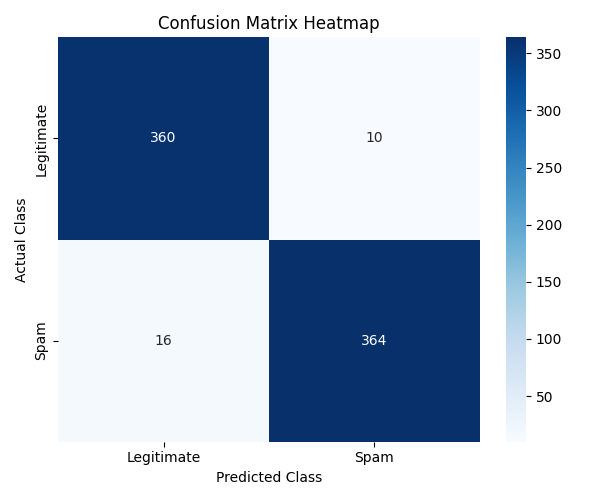
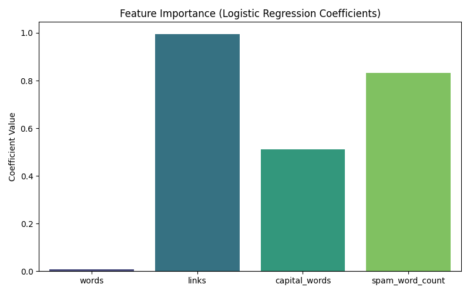

# aimlmid2026_g_tsikarishvili25
AI and ML for Cybersecurity  - Midterm Exam

# 1. Pearson Correlation Analysis

This project analyzes a dataset extracted from the "aiml_midterm" graph.
The goal is to calculate Pearson's correlation coefficient to determine 
the strength of the linear relationship between the X and Y variables.

### The Data
The following 8 data points were extracted from the graph:

| X Coordinate | Y Coordinate |
| :---: | :---: |
| -7.40 | -5.30 |
| -4.90 | -2.90 |
| -2.40 | -0.70 |
| 0.10 | 1.40 |
| 2.50 | 3.20 |
| 5.00 | 5.50 |
| 7.40 | 7.30 |
| 9.80 | 8.90 |

### Results
* **Pearson's Correlation Coefficient (r):** 0.9994
* **Interpretation:** There is a near-perfect positive linear relationship between X and Y.

### Visualization
Below is the scatter plot generated from the data, including a trendline.


### Python Solution
The following script was used to calculate the coefficient and generate the plot:

```python
import numpy as np
import matplotlib.pyplot as plt

# Data
x_data = np.array([-7.40, -4.90, -2.40, 0.10, 2.50, 5.00, 7.40, 9.80])
y_data = np.array([-5.30, -2.90, -0.70, 1.40, 3.20, 5.50, 7.30, 8.90])

# Calculation
correlation_matrix = np.corrcoef(x_data, y_data)
pearson_r = correlation_matrix[0, 1]

print(f"Pearson's r: {pearson_r}")

# Plotting
plt.figure(figsize=(10, 6))
plt.scatter(x_data, y_data, color='blue', label='Data Points')
plt.title(f"Pearson Correlation (r = {pearson_r:.4f})")
plt.xlabel("X")
plt.ylabel("Y")
plt.legend()
plt.grid(True)
plt.savefig('graph.png') # Saves the image to use in README
plt.show()
```


# 2. Spam email detection

### Data Source
The dataset used for this project is ```g_tsikarishvili25_93455.csv```.
It contains **2500** email entries with the following features:

1. ```words```: Total word count.

2. ```links```: Number of hyperlinks.

3. ```capital_words```: Number of capitalized words.

4. ```spam_word_count```: Count of specific spam-related keywords.

5. ```is_spam```: Class label (1 for Spam, 0 for Legitimate).

### Model Training
The application uses a Logistic Regression model, which is suitable for binary classification tasks like spam detection.

Data Loading and Processing Code: The data is loaded using pandas.
We split the dataset into features (```X```) and the target (```y```), and then
further split it into training (70%) and testing (30%) sets.

``` Python
import pandas as pd
from sklearn.model_selection import train_test_split
from sklearn.linear_model import LogisticRegression

# Load Data
filename = 'g_tsikarishvili25_93455.csv'
try:
    df = pd.read_csv(filename)
except FileNotFoundError:
    print(f"Error: File '{filename}' not found. Please check the file path.")
    exit()

# --- 2. Train Logistic Regression Model ---
# Define Features and Target
X = df[['words', 'links', 'capital_words', 'spam_word_count']]
y = df['is_spam']

# Split Data (70% Train, 30% Test)
X_train, X_test, y_train, y_test = train_test_split(X, y, test_size=0.3, random_state=42)

# Initialize and Train Model
model = LogisticRegression()
model.fit(X_train, y_train)
```
#### Model Coefficients: 
The model learned the following weights for each feature. 
A positive coefficient increases the likelihood of an email being spam, while the large negative intercept
indicates a strong baseline bias towards "legitimate" (meaning an email needs significant "spammy" features 
to be classified as spam).

* **Intercept**: -10.37

* **links**: +0.996 (Strong indicator)

* **spam_word_count**: +0.833 (Strong indicator)

* **capital_words**: +0.511 (Moderate indicator)

* **words**: +0.008 (Weak indicator)

### Validation Results
We evaluated the model on the 30% test set (750 emails).
#### Confusion Matrix and Accuracy Code:
```
from sklearn.metrics import confusion_matrix, accuracy_score

y_pred = model.predict(X_test)
acc = accuracy_score(y_test, y_pred)
cm = confusion_matrix(y_test, y_pred)

print("\n--- Validation Results ---")
print(f"Accuracy: {acc * 100:.2f}%")
print("Confusion Matrix:\n", cm)
```
#### Results:

* Accuracy: 96.5%

* Confusion Matrix:

    * True Negatives (Legitimate correctly identified): 360

    * False Positives (Legitimate mistook for Spam): 10

    * False Negatives (Spam mistook for Legitimate): 16

    * True Positives (Spam correctly identified): 364

### Application Logic (Email Checking)
The following function simulates the feature extraction process to classify new raw text. 
Since the exact "spam word dictionary" was not provided in the dataset description, 
a standard list of spam keywords was used for this function.

```
spam_keywords = ["free", "win", "prize", "money", "offer", "click", "buy", "urgent", "cash", "winner"]


def check_email(text):
    words_list = text.split()

    # Extract features
    f_words = len(words_list)
    f_links = text.count('http') + text.count('www')
    f_caps = sum(1 for w in words_list if w.isupper() and len(w) > 1)
    f_spam = sum(1 for w in words_list if w.lower() in spam_keywords)

    # Create a DataFrame with column names to silence the Sklearn warning
    features = pd.DataFrame(
        [[f_words, f_links, f_caps, f_spam]],
        columns=['words', 'links', 'capital_words', 'spam_word_count']
    )

    prediction = model.predict(features)[0]
    prob = model.predict_proba(features)[0][1]

    return "SPAM" if prediction == 1 else "LEGITIMATE", prob
```
### Spam Email Example
Composed Text: "URGENT! WINNER!! You have WON $1000000 FREE CASH! CLICK HERE:
http://win.com http://claim.net http://prize.org. BUY NOW!"

Explanation: This email was manually composed to trigger the model's spam detection
by maximizing the high-coefficient features:

* It contains **3 links (http://...)**, which is a very strong indicator (Coefficient ~1.0 per link).

* It uses **heavy capitalization** ("URGENT", "WINNER", "WON", "FREE", "CASH", "CLICK", "HERE", "BUY", "NOW"),
triggering the ```capital_words``` feature.

* It is packed with **spam keywords** ("free", "cash", "win", "buy", "urgent"). These features combined overcome
the negative intercept, resulting in a high probability of being classified as **SPAM**.

### Legitimate Email Example
Composed Text: "Hi Sarah, I hope you are doing well. Please find the attached meeting notes. Best, John."

Explanation: This email is classified as **LEGITIMATE** because:

* It has **0 links**.

* It has almost **0 fully capitalized words** (only standard grammar).

* It contains **0 spam keywords**. Without these features driving the score up, 
* the model remains at its baseline (determined by the negative intercept), confidently predicting it as safe.

### Visualizations
**A. Confusion Matrix Heatmap** 
This heatmap visualizes the performance of the classification. 
The dark squares on the diagonal (360 and 364) show that the model is correct the vast majority of the time, 
with very few errors (light squares off-diagonal).



**B. Feature Importance (Coefficients)**
This bar chart displays the weight the model assigns to each feature. 
It clearly shows that Links and Spam Word Count are the most critical factors in deciding if an email is spam,
while the total number of words has almost no impact.

