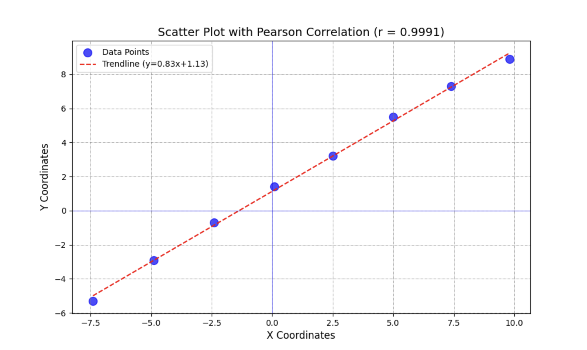

# aimlmid2026_g_tsikarishvili25
AI and ML for Cybersecurity  - Midterm Exam

```markdown
# 1. Pearson Correlation Analysis

This project analyzes a dataset extracted from the "aiml_midterm" graph.
The goal is to calculate Pearson's correlation coefficient to determine 
the strength of the linear relationship between the X and Y variables.

# The Data
The following 8 data points were extracted from the graph:

| X Coordinate | Y Coordinate |
| :---: | :---: |
| -7.40 | -5.30 |
| -4.90 | -2.90 |
| -2.40 | -0.70 |
| 0.10 | 1.40 |
| 2.50 | 3.20 |
| 5.00 | 5.50 |
| 7.40 | 7.30 |
| 9.80 | 8.90 |

# Results
* **Pearson's Correlation Coefficient (r):** 0.9994
* **Interpretation:** There is a near-perfect positive linear relationship between X and Y.

# Visualization
Below is the scatter plot generated from the data, including a trendline.



# Python Solution
The following script was used to calculate the coefficient and generate the plot:

```python
import numpy as np
import matplotlib.pyplot as plt

# Data
x_data = np.array([-7.40, -4.90, -2.40, 0.10, 2.50, 5.00, 7.40, 9.80])
y_data = np.array([-5.30, -2.90, -0.70, 1.40, 3.20, 5.50, 7.30, 8.90])

# Calculation
correlation_matrix = np.corrcoef(x_data, y_data)
pearson_r = correlation_matrix[0, 1]

print(f"Pearson's r: {pearson_r}")

# Plotting
plt.figure(figsize=(10, 6))
plt.scatter(x_data, y_data, color='blue', label='Data Points')
plt.title(f"Pearson Correlation (r = {pearson_r:.4f})")
plt.xlabel("X")
plt.ylabel("Y")
plt.legend()
plt.grid(True)
plt.savefig('graph.png') # Saves the image to use in README
plt.show()